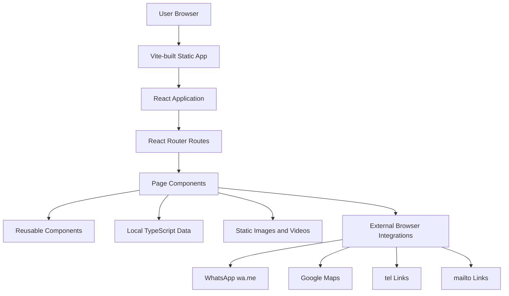
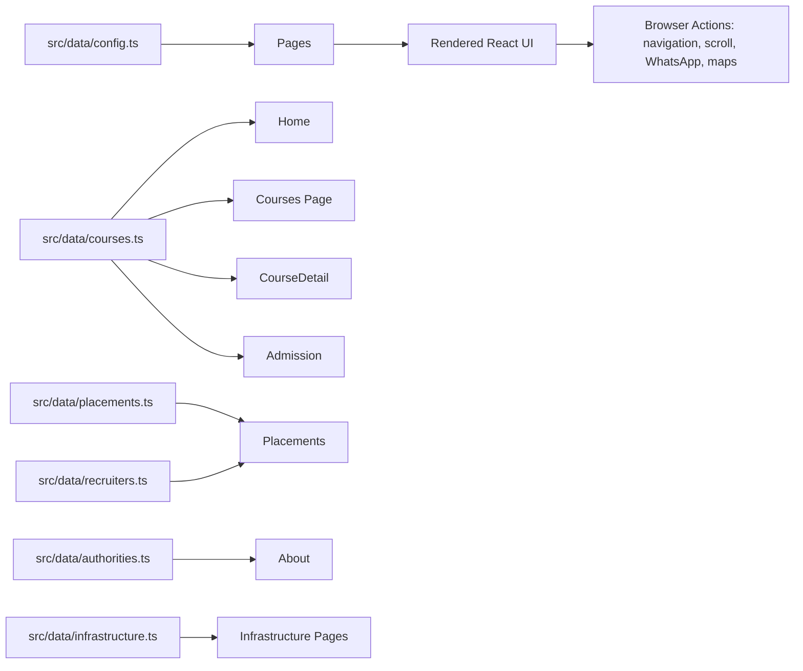
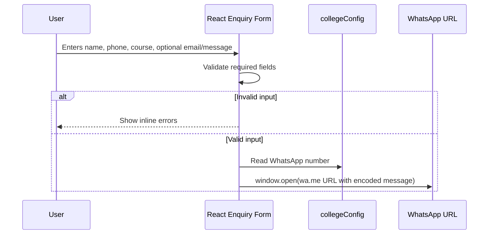

# Architecture

## Architecture Style

The project is a frontend-only React single-page application. It uses client-side routing, static local data modules, static media assets, and browser-based integrations such as WhatsApp, phone links, email links, and Google Maps.

No backend architecture, server API, database layer, authentication provider, or authorization mechanism was found in the current codebase.

## High-Level Architecture

## Frontend Architecture

`src/main.tsx` creates the React root and renders `App` inside `BrowserRouter`. `src/App.tsx` defines the route table and lazy-loads each page with `React.lazy` and `Suspense`. Shared layout elements include `Navbar`, `Footer`, `ScrollProgress`, and `MoveToTop`.

Route transitions are handled with Framer Motion `AnimatePresence` and `motion.main`. Smooth scrolling is initialized through `useLenis`.

## Routes

| Path | Component | Purpose |
| --- | --- | --- |
| `/` | `Home` | Home page, courses preview, gallery, enquiry section. |
| `/about` | `About` | College story, infrastructure links, authorities. |
| `/courses` | `Courses` | Course listing. |
| `/courses/:slug` | `CourseDetail` | Course detail pages; unknown slugs redirect to `/courses`. |
| `/admission` | `Admission` | Admission process, eligibility, documents, FAQ, enquiry. |
| `/placements` | `Placements` | Placement stats, recruiters, student stories, training information. |
| `/life-at-dc` | `LifeAtDC` | Campus and student-life content. |
| `/contact` | `Contact` | Contact options, form, map, hours, FAQ. |
| `/about/infrastructure/academic` | `AcademicInfrastructure` | Academic infrastructure content. |
| `/about/infrastructure/non-academic` | `NonAcademicInfrastructure` | Non-academic infrastructure content. |

## Backend Architecture

Not determined from the current codebase. No backend source directory, API server, server routes, ORM, database client, or server deployment configuration was found.

## Data Layer

The application reads structured content from local TypeScript modules:

- `src/data/courses.ts`
- `src/data/placements.ts`
- `src/data/recruiters.ts`
- `src/data/infrastructure.ts`
- `src/data/authorities.ts`
- `src/data/config.ts`

This is static application data bundled into the frontend. Some route pages also define page-specific static arrays directly inside the page component files, including the life-at-DC and infrastructure pages.

## External Services

| Service | Usage |
| --- | --- |
| WhatsApp | Enquiry forms and quick links open `https://wa.me/...` URLs. |
| Google Maps | Contact page embeds a map and links to directions using configured address data. |
| Phone | `tel:` links use `collegeConfig.phoneHref`. |
| Email | `mailto:` links use `collegeConfig.email`. |
| Facebook / Instagram | Home quick links use configured social URLs. |

## API Communication

No `fetch`, Axios, or internal HTTP API layer was found. Form submissions do not send data to a server; they construct a message and open WhatsApp in a new browser tab/window.

## Authentication Flow

Not determined from the current codebase. No login, signup, session, token, role, or protected route implementation was found.

## State Management

State is local component state via React hooks such as `useState`, `useEffect`, `useLayoutEffect`, and `useRef`. There is no Redux, Zustand, React Query, Context-based global state, or server cache layer in the current codebase.

Examples:

- Active gallery image and lightbox state in `Home`.
- Form values and validation errors in `Home`, `Admission`, `Contact`, and `EnquiryModal`.
- Active placement filter and testimonial index in `Placements`.
- Active hero slide indexes in several pages.

## Navigation And Data Flow

## Enquiry Flow

## Component Relationships

`App` composes global layout components and route pages. Pages consume shared data and reusable presentation components such as course cards, placement cards, section headings, image reveal helpers, navigation, footer, and movement/scroll UI.

The codebase currently favors page-local sections and animation logic over a deeply abstracted component library.
