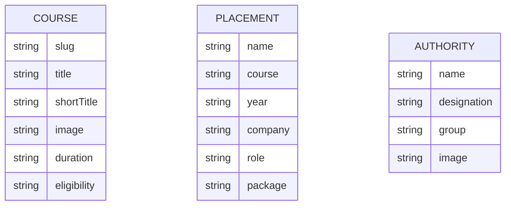

# Database And Storage

## Database Technology

No database technology was found in the current codebase.

The application uses local static TypeScript data modules and public media assets. This data is bundled into the frontend build.

## Static Data Modules

| File | Data |
| --- | --- |
| `src/data/courses.ts` | Course records and course options. |
| `src/data/placements.ts` | Placement statistics and student placement stories. |
| `src/data/recruiters.ts` | Recruiter names and logo paths. |
| `src/data/infrastructure.ts` | Academic and non-academic infrastructure entries. Current infrastructure pages also define their own local arrays. |
| `src/data/authorities.ts` | Leadership, coordinator, and department-head profiles. |
| `src/data/config.ts` | College contact information and external-link configuration. |

## Entity-Like Structures

### Course

Defined in `src/data/courses.ts`.

Fields include:

- `slug`
- `title`
- `shortTitle`
- `description`
- `image`
- `duration`
- `eligibility`
- `qualification`
- `notes`
- `certifications`
- `careers`
- `skills`
- `highlights`

### Placement

Defined in `src/data/placements.ts`.

Fields include:

- `name`
- `course`
- `year`
- `company`
- `role`
- `package`
- `image`

### Authority

Defined in `src/data/authorities.ts`.

Fields include:

- `name`
- `designation`
- `group`
- `image`

## Relationships

There are no database-enforced relationships. Components relate data in memory by importing modules and filtering arrays. For example, `Placements.tsx` filters placement records by their `course` value, and `CourseDetail.tsx` finds a course by `slug`.

This diagram describes static frontend data shapes, not a persisted relational schema.

## Read And Write Flows

The app reads static data at build/runtime through ES module imports. No runtime writes to a database or local storage were found.

Enquiry forms do not persist data in the application. They open WhatsApp with a generated message.

## Storage And Security Considerations

- Static data in `src/data` is public after bundling.
- Do not store secrets, private tokens, passwords, or API keys in these files.
- User enquiry input is not stored by this application.
